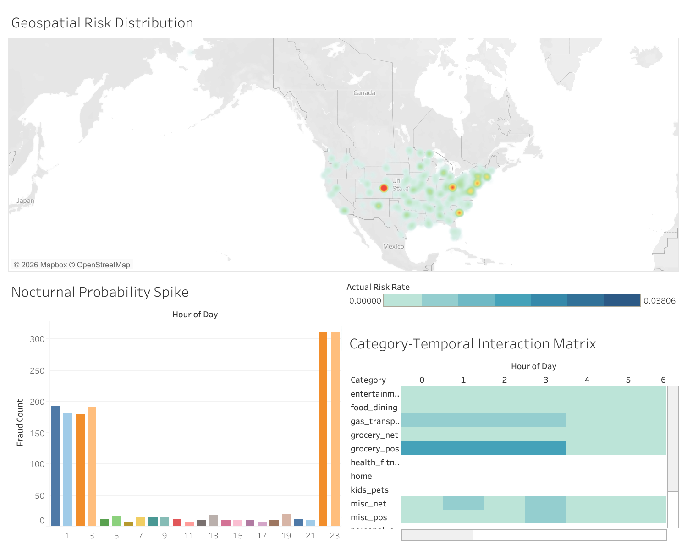

# Financial-Fraud-Detection-SQL-Analysis

## Questions (The Ask)

### Problem Statement
This project involves the analysis of a large-scale dataset containing approximately 1.4 million credit card transaction records collected over the past two years. Out of this, nearly 1.3 million records are designated for training purposes. The dataset may contain inconsistencies, missing values, or anomalous entries that require systematic cleaning and validation.

### Objective
The objective is to build a robust analytical pipeline from raw data to actionable business intelligence:

#### Data Engineering (SQL): Systematic cleaning, validation, and resolution of data quality issues including duplicates, null values, and invalid entries.

#### Exploratory Data Analysis (SQL): Identifying the behavioral "DNA" of fraud, focusing on spending spikes, high-velocity transactions, and geographical anomalies.

#### Executive Visualization (Tableau): Developing a high-level Business Intelligence dashboard to visualize geographical and temporal "Hot Zones" of financial risk.

#### Predictive Modeling (Python): (Exploratory Phase) Investigating the feasibility of automated anomaly detection and machine learning classifiers to handle the 0.5% class imbalance.
Additionally, the processed data will be prepared for further analytical tasks, including potential modeling and visualization to support deeper insights into fraud detection.

## Data Preparation and Processing
To ensure the integrity of the 1.3 million records, a systematic data audit and cleaning pipeline was executed. Despite the large scale of the dataset, the following protocols were performed to maintain high data quality:

### Data Integrity Audit
A comprehensive audit was performed using SQL to identify structural and logical inconsistencies. The audit focused on three primary risk areas:

Null Values: Verified that critical fields, including amt, is_fraud, and trans_num, contained zero null entries.

Invalid Transaction Amounts: Identified and flagged any records with transaction values less than or equal to zero.

Primary Key Uniqueness: Checked the trans_num identifier for duplicate entries across the 1.3 million training rows.

### Validation Results
The processing phase confirmed a high level of data cleanliness:

Zero Nulls: 100% data density across all analyzed columns.

Zero Inconsistencies: All transaction amounts were found to be positive, valid numerical entries.

Zero Duplicates: Each of the 1,296,675 records (approx.) possesses a unique transaction identifier, ensuring no skewed results during behavioral analysis.

## Data Analysis & Behavioral Insights

This section analyzes the differences between legitimate and fraudulent transactions within the training dataset (approximately 1.3 million records), with the aim of identifying consistent behavioral patterns.

### 1. Transaction Amount Disparity

A clear difference exists in transaction amounts between fraud and non-fraud cases.

Fraudulent transactions show a much higher average amount, roughly eight times greater than legitimate transactions. In contrast, legitimate transactions remain relatively stable and lower in value.

Insight:  
Fraud in this dataset is generally associated with high-value transactions, indicating a tendency toward larger, more aggressive financial activity rather than small, frequent attempts.

### 2. Category-Based Behavior Analysis

To determine whether the higher fraud amounts were influenced by naturally expensive categories, transaction behavior was analyzed relative to category-specific averages.

#### 2.1 Signal Identification

Fraudulent transactions were compared against the average transaction value within each category. This ensured that the observed differences were not simply due to category-level pricing variations.

#### 2.2 Fraud Behavior Patterns

The analysis suggests two distinct patterns of fraudulent activity.

High-value fraud:  
In most categories, fraudulent transactions exceed the normal spending range by a noticeable margin. These cases are relatively easier to identify due to their deviation from typical behavior.

Stealth fraud:  
In a smaller number of categories, fraudulent transactions fall below the category average. This indicates attempts to mimic regular, low-value transactions, likely to avoid detection.

Insight:  
Fraudulent behavior is not consistent across all scenarios. While many cases involve large transaction amounts, some follow a more subtle pattern designed to blend in with normal activity.

### Key Takeaways

Fraudulent transactions are rare but tend to involve higher amounts.  
Most fraud cases show clear deviation from normal transaction values.  
A smaller portion follows patterns that resemble regular user behavior.  
Effective analysis should account for both obvious and subtle forms of fraud.
### 3. Time-Based Fraud Pattern

Transaction data was analyzed across different hours of the day to evaluate how fraud risk varies over time.

The results show a strong concentration of fraud during late-night hours, specifically between 10 PM and 3 AM. During this period, fraudulent transactions account for approximately 1.4 percent to 2.9 percent of all transactions.

Outside of this window, the fraud rate drops sharply and remains consistently below 0.15 percent.

Insight:  
This indicates that transactions occurring during late-night hours carry a significantly higher probability of being fraudulent compared to daytime activity. The difference is substantial, suggesting that time of transaction is a critical risk factor rather than just a behavioral pattern.

This finding highlights the importance of incorporating time-based features when analyzing or monitoring transaction risk.
### 4. Location-Based Fraud Distribution

Fraud rates were analyzed across cities, considering only those with a minimum of 100 transactions to ensure statistical reliability.

The analysis reveals significant variation in fraud rates across locations, indicating that fraud risk is not uniformly distributed.

#### Top High-Risk Cities

The following cities show the highest fraud rates:

| City                  | State | Fraud Rate (%) |
|----------------------|-------|----------------|
| Aurora               | CO    | 4.49           |
| Clearwater           | FL    | 4.34           |
| Moscow               | IA    | 3.10           |
| Boulder              | MT    | 3.04           |
| Riverview            | MI    | 2.98           |
| Howes Cave           | NY    | 2.98           |
| Bay City             | OR    | 2.94           |
| Girard               | GA    | 2.92           |
| Pearlington          | MS    | 2.84           |
| White Sulphur Springs| WV    | 2.84           |

Insight:  
Certain cities exhibit significantly higher fraud rates compared to the overall dataset average (~0.58 percent). These locations represent potential high-risk zones and may require closer monitoring.

This reinforces that geographic features can contribute to fraud detection, especially when combined with transaction volume and other behavioral indicators.
### 5. Category Behavior During High-Risk Hours

A combined analysis of transaction category and time was performed to evaluate how fraud risk varies across categories during high-risk hours (10 PM to 3 AM).

The results show that fraud rates differ significantly between categories within the same time window.

#### High-Risk Categories at Night

| Category       | Fraud Rate (%) |
|----------------|---------------|
| shopping_net   | 6.01          |
| misc_net       | 3.96          |
| grocery_pos    | 3.59          |
| shopping_pos   | 2.52          |

#### Lower-Risk Categories at Night

| Category       | Fraud Rate (%) |
|----------------|---------------|
| home           | 0.85          |
| grocery_net    | 0.75          |
| food_dining    | 0.74          |

Insight:  
Fraud risk during late-night hours is not uniform across categories. Online and retail-related categories show significantly higher fraud rates, while everyday spending categories such as food and home exhibit lower risk.

This indicates that fraud detection strategies should consider both time and transaction type together rather than treating them as independent factors.
## Visualization & Dashboard (Tableau)

This section presents the visual layer of the project, where analytical findings are translated into interactive dashboards for better interpretation and exploration.

### 1. Data Pre-processing

Before importing into Tableau, the dataset was refined to ensure consistency and usability:

- Removed formatting artifacts from SQL exports (extra spaces, separators)
- Standardized column structure for clean ingestion
- Formatted `Hour_of_Day` as a two-digit string (00–23) to preserve correct chronological ordering in visualizations

---

### 2. Geospatial Risk Heatmap

Type: Density Map  

Instead of plotting individual city points, a density map was used to highlight regions with higher concentrations of fraud. This approach avoids overlapping markers and improves clarity.

Color Encoding:  
A diverging color scale centered around the global fraud rate (~0.58%) was applied to distinguish low-risk and high-risk zones.

Insight:  
Certain geographic regions show noticeably higher fraud concentration, supporting the earlier location-based analysis.

---

### 3. Temporal Analysis (Fraud by Hour)

Type: Bar Chart  

This visualization captures the variation of fraud risk across different hours of the day.

Insight:  
A clear spike in fraud activity is observed between 22:00 and 03:00, confirming the time-based pattern identified during SQL analysis.

---

### 4. Category–Time Interaction Analysis

Type: Heatmap Matrix  

This chart combines transaction category and hour of day to analyze how fraud risk changes across both dimensions simultaneously.

Insight:  
Online shopping (`shopping_net`) emerges as the highest-risk category during late-night hours, reinforcing the importance of combining multiple features in fraud detection.

---

### 5. Dashboard Interactivity

Feature: Action Filters  

The dashboard includes interactive filtering:

- Selecting a region on the map dynamically updates other visualizations  
- Enables focused analysis of fraud patterns within specific geographic areas  

This allows users to explore how fraud behavior varies across different locations.

---

### 6. Dashboard Preview

The complete dashboard is included as an image:

[]

This dashboard integrates all key insights:
- Geographic distribution  
- Time-based patterns  
- Category-based risk  
- Combined behavioral analysis  

---

### Summary

The visualization layer complements the SQL analysis by:
- Making patterns easier to interpret  
- Enabling interactive exploration  
- Highlighting relationships between multiple variables  

Together, they form a complete analytical workflow from raw data to actionable insights.
